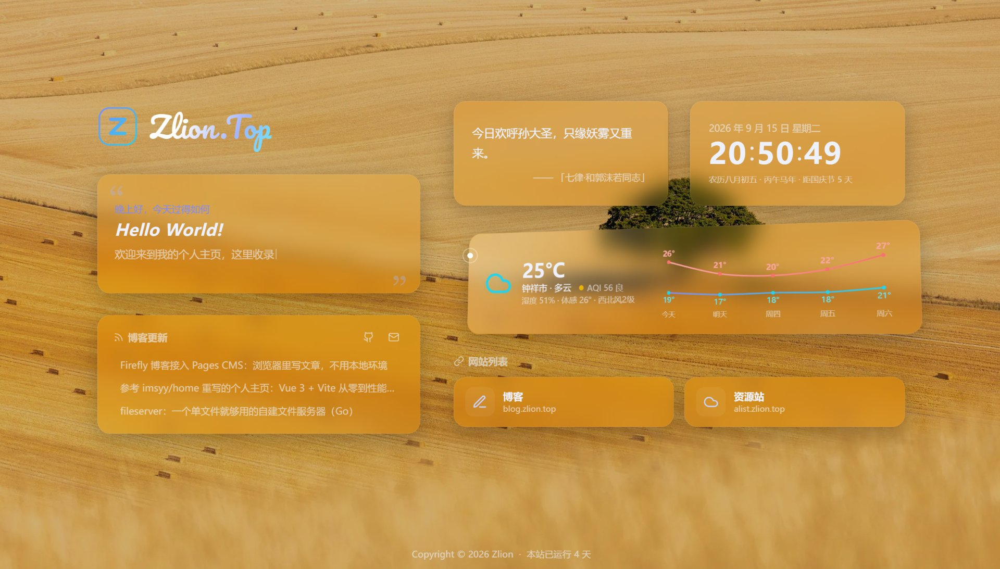
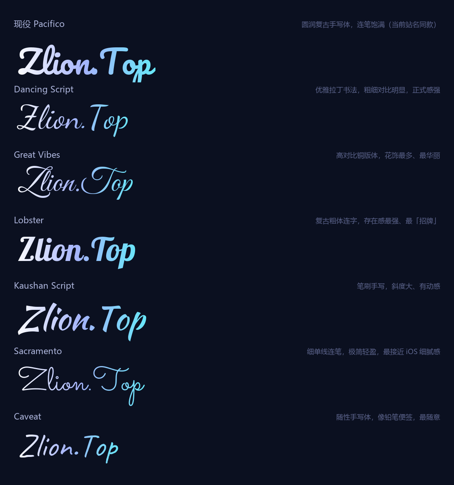

# homepage

参考 [imsyy/home](https://github.com/imsyy/home) 风格编写的个人主页，使用 **Vue 3 + Vite** 构建，开箱即用，零配置部署到 Vercel。



「网站列表」「站点监控」等卡片里的站点默认为示例（`example.com`），在 `src/config.js` 里的 `siteLinks` / `siteMonitors` 改成你自己的即可。

## 功能

- 载入动画、极光渐变背景（随昼夜时段自动变色，支持自定义背景图）
- 按时段问候语、打字机轮换标语（超长自动滚动、光标跟随闪烁）
- 一言（Hitokoto API，失败自动兜底本地语句，点击卡片即可换一句）
- 实时时钟与日期（农历 + 节日倒数）
- 实时天气长卡（uapis 聚合接口：免 Key、自动定位到县级、湿度/体感/AQI、未来几天高低温双曲线，可固定城市）
- 网站列表（一行 3 个紧凑卡片，在 config.js 里加站点自动扩展）
- 博客更新卡（自动拉取博客 RSS 展示最新 3 篇文章，卡头含 GitHub / 邮箱等社交图标）
- 二级「探索更多」面板（点击左上角 Logo 进入）：
  - 每日新闻（60s API，自动更新）
  - 多平台热榜（微博/B站/V2EX/IT之家/知乎/掘金等，平台与顺序可配置）
  - 音乐播放器（网易云歌单，多源自动切换 + 断链自愈 + 歌词同步，填歌单 ID 启用）
  - Epic 限免（两款游戏完整展示）
  - 程序员历史上的今天
  - 站点监控（实时探测自己各站点的连通状态与响应耗时，访客视角）
  - GitHub 数据卡（可选）
- 页脚建站运行天数
- 自定义圆点光标 + 移动/点击涟漪、卡片悬停 3D 倾斜 + 光泽动效（手感对齐 FluentPlayer 封面）
- 移动端自适应、暗色玻璃拟态风格；所有卡片均可在 config.js 中开关与排序

**TODO（计划中）**：

- [ ] 更多卡片支持（欢迎 PR / 提 Issue 讨论想看到的卡片）
- [❌] 卡片位置自定义（拖拽排序 / 布局记忆）
- [ ] 音乐卡 AMLL 效果（[Apple Music-like Lyrics](https://github.com/amll-dev/applemusic-like-lyrics) 歌词动效：逐字点亮、弹性动画、灵感专辑封面背景）

## 部署

### 平台托管部署（推荐）

参考 [Vercel 官方指南](https://vercel.com/docs/frameworks/frontend/vite) 将本项目部署至 Vercel、Netlify、Cloudflare Pages 等平台。主流平台自动部署，会根据环境自动选择适配器。

框架预设：`Vite`

根目录：`./`

输出目录：`dist`

构建命令：`npm run build`

安装命令：`npm install`

[](https://vercel.com/new/clone?repository-url=https://github.com/Zlion-Y/homepage&project-name=homepage&repository-name=homepage)

> 想绑定自己的域名（如 `home.example.com`）：在 Vercel 项目设置 → **Domains** 中添加，按提示到域名 DNS 处加一条 CNAME 记录指向 `cname.vercel-dns.com` 即可。

### 本地开发部署

1. **克隆仓库：**

   **先 [Fork](https://github.com/Zlion-Y/homepage/fork) 到自己仓库再克隆（推荐），记得先点 Star 再 Fork 哦！**

   ```bash
   git clone https://github.com/you-github-name/homepage.git
   cd homepage
   ```

2. **安装依赖：**

   ```bash
   npm install
   ```

3. **自定义配置：**

   - 编辑 `src/config.js` 自定义站点设置（站点信息、卡片开关、面板排列、监控站点等）

4. **启动开发服务器：**

   ```bash
   npm run dev
   ```

   页面将在 `http://localhost:5173` 可用，修改配置实时热更新。

## 自定义

### 基本信息（最重要）

所有个性化内容集中在 **`src/config.js`**，修改后提交推送即可自动重新部署：

| 配置项 | 说明 |
| --- | --- |
| `siteConfig.siteName` | 左上角站点名称 |
| `siteConfig.pageTitle` | 浏览器标签页标题 |
| `siteConfig.siteFont` | 站名手写体，可选 key 见[「站名字体」](#站名字体)一节 |
| `siteConfig.logo` | Logo 图标：留空用内置「Z」徽章；填图片路径/URL 替换（载入页、左上角、favicon 同步生效） |
| `siteConfig.greet` | 问候语大标题 |
| `siteConfig.desc` | 一句话介绍（打字机轮换的第一句） |
| `siteConfig.motto` | 打字机轮换标语数组，只留一项则固定显示 |
| `siteConfig.siteStart` | 建站日期，页脚据此显示「已运行 N 天」 |
| `siteConfig.author` | 页脚版权署名 |
| `siteConfig.repo` | 页脚署名的超链接（主页仓库地址），留空显示纯文字 |
| `siteConfig.clickEffect` | 自定义光标 + 涟漪特效开关 |
| `siteConfig.cardTilt` | 卡片 3D 倾联动效开关（含音乐全屏播放器封面），`false` 关闭 |
| `siteConfig.weatherCity` | 天气城市 adcode，留空 = 自动定位 |
| `siteConfig.bgApi` | 随机壁纸 API，见[「自定义背景」](#自定义背景)一节 |
| `siteConfig.homeCards` | 主页各卡片开关（greet / blog / hitokoto / clock / weather / siteLinks），`false` 隐藏 |
| `siteConfig.panelCards` | 二级面板卡片排列：数组顺序 = 排列顺序，删掉某项 = 隐藏该卡 |
| `siteConfig.panelTips` | 进入二级面板时的烟花提示文案池，留空数组只放烟花不显示提示 |
| `siteConfig.githubUser` | GitHub 卡的用户名（需把 `github` 加入 `panelCards` 才显示） |
| `siteConfig.musicPlaylist` | 音乐卡网易云歌单 ID（需把 `music` 加入 `panelCards` 才显示） |
| `siteConfig.musicSource` | 播放直链来源：`meting` / `proxy`，见[「音乐播放器」](#音乐播放器)一节 |
| `siteConfig.musicQuality` | 音质：128k / 320k / flac / flac24bit |
| `siteConfig.hotPlatforms` | 热榜平台与顺序（weibo / bilibili / v2ex / ithome / hellogithub / zhihu / juejin / sspai 等） |
| `siteConfig.siteMonitors` | 站点监控卡的目标站点列表（`{ name, url }`，需把 `monitor` 加入 `panelCards`） |
| `socialLinks` | 「博客更新」卡里的社交图标（GitHub / 邮箱等，**记得改成自己的**） |
| `siteLinks` | 网站列表卡片 |

社交图标 `icon` 可选：`github` / `mail` / `bilibili` / `telegram` / `qq` / `rss`
网站图标 `icon` 可选：`blog` / `cloud` / `music` / `video` / `code` / `star`

### 音乐播放器

填入网易云歌单 ID（歌单页地址栏 `playlist?id=xxx`）即可启用。播放器特性：

- 多 Meting 源并发竞速拉取歌单，单源故障无感
- 每首歌自动在多个源之间探测可用播放链接，断链/过期自愈
- 全部源失败自动跳下一首，红字提示不打哑巴尬
- 歌单本地缓存 6 小时，进面板秒开；预载但不自动出声，点击播放才响
- 歌词同步滚动居中，点歌词行跳转进度
- **洛雪音源解析**（serverless 函数，内置可选，随本仓库部署在 Vercel，见下）

#### 洛雪音源解析（serverless，内置可选）

公共 Meting 接口对 VIP / 版权受限曲目拿不到可播放直链。本仓库内置一份 **serverless 版的洛雪音源解析**
（`api/` + `lib/`，跟主页一起部署在 Vercel），把洛雪（LX Music）自定义音源脚本跑在函数里。
**仓库默认 `"meting"` 开箱即用**；想解锁 VIP 曲完整直链就按下面配置启用：

- 前端调**同源**的 `/api/url`：不需要额外域名、证书、CORS 配置，也不用再维护一台服务器；
- 服务端用 Node 原生 `vm` 跑脚本（脚本本来就是 JS，连垫片都不用），
  多音源按成绩分波对冲、赢家一出即掐断其余、直链探活、连续失败熔断；
- 直链缓存放在 CDN 边缘（`s-maxage=900`），**命中缓存的请求根本不进函数**，不消耗调用次数；
- 解析不到时自动降级回 Meting，所以**开着也不影响原来能用的情况**。

`config.js` 里对应的开关：

```js
musicSource: "meting",   // 默认只走公共 Meting 接口；"proxy" = 走自带的 serverless 解析
musicQuality: "320k",    // 128k / 320k / flac / flac24bit
```

启用 `"proxy"` 需要自备音源脚本：放 [`sources/`](sources/README.md)（仓库只带示例脚本，**真实音源请自行准备**，
参考 [lxmusic-](https://github.com/guoyue2010/lxmusic-)），或配 `SOURCE_URLS` 环境变量指向在线脚本——
改了远端脚本后不用重新部署，打开 `https://你的域名/api/health?refresh=1` 即可让函数立刻重装全部音源。
部署后打开 `https://你的域名/api/health` 能看到装上了哪些音源、各自的平台与失败原因。

### 站点监控卡

`siteMonitors` 里列出你的站点，卡片会用访客浏览器直连探测（与访客能否打开一致），显示绿/红状态与响应耗时，每 60 秒自动刷新。无需任何第三方监控服务。

### 自定义背景

三种方式（`src/config.js` 的 `bgApi`）：

1. **默认**：留空使用动态极光渐变背景
2. **静态图**：把图片命名为 `background.jpg` 放到 `public/images/` 即自动生效（无需改配置，会自动压暗保证文字可读）
3. **随机壁纸 API**：`bgApi` 填接口地址，每次打开页面随机换一张，加载完成后淡入、失败自动回退极光渐变。已实测可用的接口：
   - `https://bing.liushen.fun/api/random?redirect=true`（必应每日壁纸，当前启用）
   - `https://www.dmoe.cc/random.php`、`https://t.alcy.cc/ycy`、`https://api.paugram.com/wall/`（二次元随机）

### 实时天气（可选）

默认使用 [uapis.cn](https://uapis.cn) 聚合天气接口，**无需申请任何 Key**：按访客 IP 自动定位（可精确到县级），显示实况温度、湿度、体感、风向风力、AQI 和未来几天高低温曲线，数据本地缓存 30 分钟。

想固定显示某个城市（不随访客位置变化）：在 `src/config.js` 里把 `weatherCity` 填为该城市的 adcode（[行政区划代码表](https://lbs.amap.com/api/webservice/download)），如 `"410100"` 郑州。

接口不可用时天气卡自动隐藏，其余功能不受影响。

### 浏览器图标

替换 `public/favicon.svg`（Z 字母徽章，可改成任何 SVG）。

### 站名字体

左上角站名使用手写艺术字渲染，内置 7 款开源字体（Google Fonts，SIL OFL 许可），
在 `src/config.js` 的 `siteFont` 里填 key 即可一键切换（写错自动回退 `pacifico`）：



| `siteFont` 取值 | 字体 | 风格 |
|---|---|---|
| `pacifico`（默认） | Pacifico | 圆润复古手写 |
| `dancing` | Dancing Script | 优雅拉丁书法 |
| `greatvibes` | Great Vibes | 铜版体、花饰最多 |
| `lobster` | Lobster | 复古粗体连字 |
| `kaushan` | Kaushan Script | 笔刷手写、有动感 |
| `sacramento` | Sacramento | 细单线连笔、最轻盈 |
| `caveat` | Caveat | 随性铅笔手写 |

字体文件与详细说明见 [`public/font/README.md`](public/font/README.md)。

## 目录结构

```
homepage/
├── docs/
│   ├── preview.jpg          # README 用的主页效果图（不进构建产物）
│   └── fonts/
│       └── preview.png      # 站名字体效果预览图
├── public/
│   ├── favicon.svg          # 网站图标
│   └── images/              # 放 background.jpg 可自定义背景
├── src/
│   ├── config.js            # ★ 所有个性化配置（卡片开关/排序也在这里）
│   ├── App.vue              # 页面布局
│   ├── style.css            # 全局样式（颜色变量等）
│   └── components/          # 各功能组件
├── api/                     # Vercel serverless 函数（音乐解析 / 健康自检）
├── lib/                     # 解析核心：音源宿主 / 调度器 / 访问控制
├── sources/                 # 洛雪音源脚本（随函数一起部署，可换成自己的）
└── vite.config.js
```

## 致谢

- 布局与功能灵感来自 [imsyy/home](https://github.com/imsyy/home)（MIT License）
- 音乐播放器实现参考 [CuteLeaf/Firefly](https://github.com/CuteLeaf/Firefly) 项目的 MusicManager
- 图标基于 [Lucide](https://lucide.dev/)（ISC License）
- 一言 API：[hitokoto.cn](https://hitokoto.cn/)；今日诗词：[jinrishici.com](https://www.jinrishici.com/)
- 天气 / 热榜 / 新闻等数据接口：[uapis.cn](https://uapis.cn/)、[60s API](https://github.com/vikiboss/60s)
- 若AI参考了您的代码，在此一并致谢。

## 说明
- 整体项目均为vibe coding实现，若侵犯了您的权益请联系我删除。
